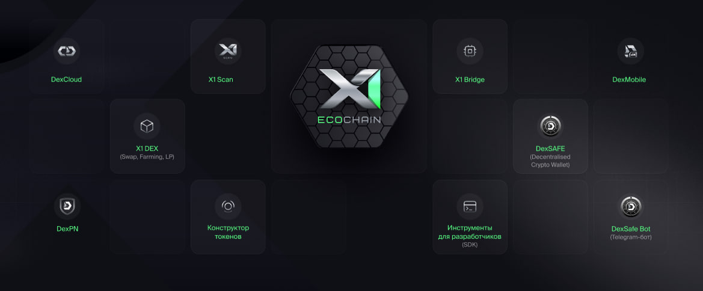

# White Paper X1 EcoChain

## Abstract

X1 EcoChain is the world’s first truly decentralized, energy-efficient, and environmentally friendly blockchain deployed on low-power X1Nodes. By combining the benefits of the Proof of Authority (PoA) consensus algorithm, low power consumption (only 3 Wh), and a scalable architecture, X1 EcoChain introduces a new paradigm of Web4 infrastructure — environmentally friendly, hacker-resistant, and entirely independent from centralized data centers.

The platform offers built-in support for the DEX-20 standard (EVM compatible), featuring a full-fledged DeFi ecosystem including a DEX, cross-chain bridge and token constructor, along with a unique tokenomics model based on a Bonding Curve Presale. Because of its innovative architecture, anyone can become a part of the network by running an X1Node at home.

X1 EcoChain is a leap into the future, where blockchain evolves beyond technology into a sustainable, global, and environmentally friendly system.

### White Paper Structure

1. [Introduction](#1-introduction)
2. [Main issues of the industry](#2-main-issues-of-the-industry)
3. [Solving the problem from X1 EcoChain](#3-solving-the-problem-from-x1-ecochain)
4. [Technical Overview of X1 EcoChain](#4-technical-overview-of-x1-ecochain)
5. [The unique architecture of X1 EcoChain](#5-the-unique-architecture-of-x1-ecochain)
6. [Comparison of X1 EcoChain with other blockchains](#6-comparison-of-x1-ecochain-with-other-blockchains)
7. [Innovation from X1 EcoChain](#7-innovation-from-x1-ecochain)
8. [X1 Coin Economics (Tokenomics)](#8-x1-coin-economics-tokenomics)
9. [Bonding Curve – A unique Presale mechanism](#9-bonding-curve-a-unique-presale-mechanism)
10. [The X1 EcoChain Ecosystem](#10-the-x1-ecochain-ecosystem)
11. [Roadmap](#11-roadmap)
12. [Conclusion](#12-conclusion)

## 1. Introduction

The modern Web3 landscape faces significant challenges: decentralization often comes at the cost of high energy consumption, while sustainable solutions tend to sacrifice independence. Blockchains like Bitcoin and Ethereum consume massive amounts of resources, rely on centralized data centers and impose high transaction fees.

X1 EcoChain was created as a response to these challenges. It’s more than just a blockchain — it’s an evolution: a next-generation decentralized network deployed on low-power X1Nodes that anyone can install at home. It offers a secure, cost-effective and scalable environment for smart contracts, DeFi services and the development of new Web4 applications.

At the core of the ecosystem lies energy efficiency (each X1Node consumes only 3 Wh), environmental consciousness, the absence of centralized points of failure, innovative tokenomics and inclusive participation through NFT-based allocations.

The mission of X1 EcoChain is to build a totally decentralized, energy efficient and secure ecosystem accessible to everyone — without the need for data centers or complex infrastructure.

### Goals:

* Achieve total decentralization at the level of physical devices
* Minimize the energy consumption of blockchain networks
* Ensure high throughput and network performance
* Make ecosystem participation accessible to every user
* We aim to build a sustainable future

X1 EcoChain is more than just a project — it's a new standard for decentralized systems, where anyone can become a part of a truly open and independent Web4 network.

## 2. Key Industry Challenges

What prevents blockchain from becoming a truly universal solution for the global economy?

1. **Centralization** – Most blockchains rely on large data centers. This creates single points of failure and undermines true decentralization.
2. **High fees** – Networks like Ethereum and Bitcoin often charge transaction fees reaching tens of dollars, especially during peak usage periods.
3. **Low speed** – Traditional blockchains struggle to process millions of transactions per second, making them unsuitable for mass adoption.
4. **Environmental impact** – Proof-of-Work blockchains demand enormous computing power, resulting in massive energy consumption. This not only strains power grids but also contributes to high carbon emissions, increasing the negative impact on the environment.

## 3. X1 EcoChain’s Solution to the Challenges

Existing solutions fail to provide a balance between decentralization, performance and sustainability. The world needs a new approach. X1 EcoChain offers a unique blockchain architecture that combines:

### **Complete Decentralization**

The network is built on thousands of independent physical X1Nodes, located in users' homes, offices and private spaces. It eliminates reliance on centralized infrastructure.

### **Energy Efficiency**

Each X1Node consumes only 3 Wh, making X1 EcoChain the most environmentally friendly blockchain in the world.

### **Proof of Authority (PoA) Consensus Algorithm**

PoA ensures instant transaction confirmation and resistance to attacks.

**Optimized Network Architecture**

Because of low-power nodes and minimal hardware requirements, X1 EcoChain demonstrates high performance and scalability.

### **Minimal commissions**

The transaction fee on the network is around $0.01, making it affordable for everyday operations and DeFi applications.

### 

### **Result**

### X1 EcoChain offers a turnkey technology solution for Web4, providing real decentralization, sustainability, security and energy efficiency in a single project.

## 4. Technical Overview of X1 EcoChain

X1 EcoChain is an innovative next-generation blockchain built on a foundation of energy efficiency, high performance and complete decentralization.

**Key Advantages of X1 EcoChain:**

✔ **Full Decentralization** — The network consists of thousands of independent X1Nodes.

✔ **Minimal Power Consumption** — Only 3 Wh, making X1 EcoChain environmentally friendly.

✔ **Proof of Authority (PoA) Consensus Algorithm** — Delivers high speed, strong security and low fees.

✔ **Built-in Support for DEX-20** — A new token standard based on EVM compatibility.

✔ **DeFi Services** — The ecosystem includes a DEX, multichain bridge and token builder.

**Consensus Mechanism**

X1 EcoChain uses the **Proof of Authority (PoA)** algorithm — a model where transaction validation is performed by selected validators based on their reputation and trust.

This approach eliminates the need for energy-intensive mining, enables lightning-fast block finalization and reduces network load.

**Advantages of PoA:**

* No mining required, which significantly reduces energy consumption.
* High block confirmation speed (\~7.5 seconds).
* Increased resistance to Sybil attacks and attempts at centralized control.

**Smart Contract and Standards Support**

X1 EcoChain is fully compatible with the Ethereum Virtual Machine (EVM), enabling developers to use familiar tools and programming languages. Additionally, a new DEX-20 token standard has been introduced, optimized specifically for the X1 EcoChain ecosystem.

**Security and Resilience**

* Validation is performed only by trusted network participants.
* Protection against Sybil and 80% attacks – malicious actors cannot forge blocks.
* Instant transaction finality – transactions are irreversible.
* Low hardware requirements – running a node does not require powerful equipment.

**Scalability and Performance**

* Processing speed: up to 2000 transactions per second (TPS).
* Block time: \~7.5 seconds.
* Transaction fees: around $0.01, making the network accessible for mass adoption.
* Scalable architecture: new X1Nodes can be added without overloading the system.

Thus, **X1 EcoChain** offers a technical architecture that combines resilience, security, high throughput and energy efficiency — paving the way for building **Web4**, a new era of decentralized applications and services.

5**. Unique Architecture of X1 EcoChain**

At the core of the X1 EcoChain network lies the **X1Node** — a low-power yet high-performance device that operates on just **3 Wh**, making X1 EcoChain the most environmentally friendly blockchain in the industry.

**X1Node** is a device equipped with a high-performance processor, large SSD storage, a unique authenticator and independent wireless communication channels.

**Key specifications of X1Node:**

CPU: 4 core Amlogic s912 Cortex  
RAM: 4 GB  
ETHERNET RJ45  
SSD: 1TB  
GSM: eSIM от DexMobile  

**Power Consumption:** 3 Wh

**Operating Temperature:** 25 ℃

**Noise Level During Operation:** 5 dB

**Compact Design:** Takes up minimal space and can be installed in apartments, offices and houses.

This architecture enables X1Nodes to be deployed in residential and office environments, fundamentally distinguishing X1 EcoChain from traditional data centers and server farms.

## 6. Comparison of X1 EcoChain with other blockchains

**Energy Consumption**

One of the key advantages of X1 EcoChain is its exceptional energy efficiency and environmentally friendliness. Unlike traditional blockchain networks that consume vast amounts of energy, X1 EcoChain relies on compact and low-power X1Nodes, each consuming only 3 Wh.

• **Bitcoin** – Thousands of megawatts (PoW mining)  
• **Ethereum** – Hundreds of megawatts (PoS)  
• **X1 EcoChain (X1Node)** – Only 3 Wh per node (the most energy-efficient, environmentally friendly and totally decentralized blockchain)

X1 EcoChain is not only a technologically advanced blockchain but also an environmentally responsible one. This approach enables practical decentralization: users can run X1Nodes at home, in the office, or even in mobile solutions without the need for expensive data centers.

### **Temperature and Noise Level**

The low power consumption of X1Node directly affects its physical characteristics, ensuring comfortable operation in any environment:

* **Operating Temperature of X1Node**: 25–35°C  
  (compared to 60–70°C in traditional servers)

**As a result**: No overheating and extended equipment lifespan.

* **Noise Level: Less than 5 dB**  
  Comparable to a barely perceptible sound

**As a result:** because of the absence of active cooling systems, the X1Node requires no fans and operates in complete silence.

**X1 EcoChain sets a new standard for sustainable blockchain infrastructure** — featuring a minimal carbon footprint, full decentralization and the ability for anyone to participate without high costs.

## 7. Innovation from X1 EcoChain

**X1 EcoChain represents a radically new approach to building blockchain infrastructure.**  
Instead of relying on bulky data centers and expensive hardware, the network is powered by compact, energy-efficient X1Nodes—accessible to everyone. This design paves the way for true decentralization, bringing blockchain technology closer to both people and the planet.

**Key Innovations of X1 EcoChain:**

– **X1Nodes are accessible to everyone** – any user can become a node owner and а part of the network.

– **No dependency on data centers** – all data is distributed across the X1Node network, eliminating risks of failure and data loss tied to centralized servers.

– **Complete protection from vulnerabilities** – decentralized architecture removes the risk of data leaks and central points of failure.

– **Full data ownership** – each user controls their own data, ensuring a high level of privacy and autonomy.

– **Resilience to cyberattacks** – with no single point of failure, the decentralized structure significantly reduces the risk of hacking.

– **Scalability by design** – X1 EcoChain solutions can easily scale as network demand grows.

– **Lower maintenance costs** – because of the low-power, cost-efficient nature of X1Nodes.

## 8. X1 Coin Economy (Tokenomics)

|  |  |  |  |  |  |  |
| :---- | ----- | ----- | ----- | ----- | ----- | ----- |
| Emission | **1 000 000 000** |  |  |  |  |  |
|  | **100%** | **Quantity** | **Average Price** | **Сlaim** | **Vesting** | **TGE** |
| **Team** | 10% | 100 000 000 |  | 36 | 1/12 |  |
| **Community** | 50% | 500 000 000 |  |  | 1/24 | 30,00% |
| **Market making** | 10% | 100 000 000 |  |  |  | 100,00% |
| **Funds and Investors** | 5% | 50 000 000 |  | 6 | 1/24 |  |
| **Advisors** | 2% | 20 000 000 |  | 12 | 1/24 |  |
| **Seed Round 1** | 5% | 50 000 000 | $0,05 | 12 | 1/12 | 5,00% |
| **Private Round 2** | 8% | 80 000 000 | $0,07 | 9 | 1/12 | 10,00% |
| **Public Round 3** | 10% | 100 000 000 | $0,09 | 6 | 1/12 | 15,00% |

## 9. Bonding Curve – A Unique Presale Mechanism

The **Bonding Curve** is a dynamic pricing model where the price of X1 Coin automatically increases with rising demand.

This creates a fair and transparent mechanism for early buyers.

Bonding Curve Formula::

The more tokens sold — the higher the price.

| Coins sold | Цена X1 Coin ($) |  |
| ----- | ----- | ----- |
| **SEED** 50M |           0.04 → 0.06 |  |
| **PRIVATE** 80M |           0.06 → 0.08 |  |
| **PUBLIC** 100M |           0.08 → 0.10 |  |

Two Key Factors That Drive the Price of X1 Coin:

1. Every 60 minutes, the coin price increases.
2. The price is recalculated when the allocated volume of coins for each hour is bought out.

The price will increase either when the hour passes or earlier if the allocated hourly volume is sold out.

Listing price: $0.30

**To participate in the Private Sale and receive allocation, you need to purchase NFT.**

| NFT | DIAMOND | PLATINUM | GOLD | Airdrop X1 Coin | Period / End | Ref. from NFT | Future Allocations |
| :---- | ----- | ----- | ----- | ----- | :---- | ----- | ----- |
| **Price** | $100,00 | $75,00 | $50,00 |  |  |  |  |
| **Seed Round 1** | $500,00 |  |  | YES | 1 week / 2 week | 10% | YES |
| **Private Round 2** |  | $1 000,00 |  | YES | 1 week / 2 week | 10% | YES |
| **Public Round 3** |  |  | $2 000,00 | YES | 1 week / 4 week | 10% | YES |
|  |  |  |  |  |  |  |  |

**SEED Round:**

**NFT DIAMOND \- 100$**

Privileges:

Participation in X1 Coin Airdrop

Access to allocation in SEED Round for 500$

Allocation on future projects on X1 Ecochain

If you don’t use your allocation within 7 days, it will expire and you’ll need to purchase a new NFT to participate again.

In case of purchasing 3 NFTs and fully utilizing the allocation (100%):

* Bonus: \+5000 in X1 Coin

Referral program:   
10% in USDT from the first line NFT sales

Using the Promo Code gives a x2 boost to the Airdrop.

**PRIVATE Round:**

**NFT PLATINUM \- $75**

Privileges:

Participation in X1 Coin Airdrop

Access to allocation in Private Round for 1000$

Allocation on future projects on X1 EcoChain

If you don’t use your allocation within 7 days, it will expire and you’ll need to purchase a new NFT to participate again.

In case of purchasing 3 NFTs and fully utilizing the allocation (100%):

* Bonus: \+10,000 in X1 Coin

Referral program:   
10% in USDT from the first line NFT sales

Using the Promo Code gives a x2 boost to the Airdrop.

**PUBLIC Round:**

**NFT GOLD \- 50$**

Privileges:

Participation in X1 Coin Airdrop

Access to allocation in Private Round for 2000$

Allocation on future projects on X1 EcoChain

If you don’t use your allocation within 7 days, it will expire and you’ll need to purchase a new NFT to participate again.

In case of purchasing 3 NFTs and fully utilizing the allocation (100%):

* Bonus: \+15,000 in X1 Coin

Referral program:   
10% in USDT from the first line NFT sales   
5% in USDT from sales with allocation.

Using the Promo Code gives a x2 boost to the Airdrop.

## 10. The X1 EcoChain Ecosystem

**X1 EcoChain** is a next-generation technological platform with a totally functional decentralized ecosystem that spans finance, communication, data storage and application development. All components of the ecosystem are seamlessly integrated, ensuring maximum flexibility, security and user independence.

The ecosystem consists of two main directions: the **DeFi infrastructure** based on X1 EcoChain and the **DEX environment**, built around the philosophy of complete decentralization and privacy.

**X1 ECO DeFi Tools**

X1 ECO DEX – Asset exchange and the ability to earn income from providing liquidity in pools/farms.

X1 ECO Bridge – A cross-chain bridge that enables the transfer of assets between X1 EcoChain and other blockchains.

Token Builder – Quick creation of your own token with the possibility of listing on X1 ECO DEX.

Developer Tools – SDK for creating DApps (DeFi services, games and other useful applications).

**DEX Ecosystem**

DexSAFE – An innovative non-custodial cryptocurrency wallet that gives users absolute control over their assets without third-party involvement.

DexCloud – Decentralized cloud data storage.

DexMobile – The world’s first totally decentralized mobile operator.

DexPN – A Decentralized Private Network consisting of physical nodes in various countries worldwide.

## 11. Roadmap

**Q4 2024**

* Development of the X1 EcoChain
* Sale of API keys for validators (SOLD OUT)
* Testnet

**Q1 2025**

* Creation of Tokenomics and White Paper
* Launch of the X1 EcoChain testnet
* Conducting stress tests and security audits
* Blockchain testing with validators

**Q2 2025**

* Development and launch of X1 ECO DEX
* Development and launch of X1 ECO Bridge
* Development and launch of Token Constructor
* Conducting the Presale of X1 Coin
* Integration of DEX-20 with top CEX and DEX
* Launch of the Mainnet
* Listing of X1 Coin on CEX and DEX
* Onboarding of advisors, ambassadors, funds and partners
* Launch of a global marketing campaign
* Hosting the first hackathon for developers and hackers
* Providing developer tools
* Legal structuring of X1 EcoChain
* Release of a product with embedded AI

**Q3 2025**

* Scaling the network and expanding the DeFi ecosystem
* Implementation of a lending protocol
* Integration of GameFi on X1 EcoChain
* New partnerships and integrations with other DeFi platforms
* Integration of the DEX-20 network into the Tether (USDT) smart contract
* Launch of new services
* Participation in international crypto events
* Active growth and expansion of the X1 EcoChain brand
* Launch of DeFi tools for investors

**Q4 2025**

* Listing of X1 Coin on various Tier 1 crypto exchanges
* Launch of the DEX auction on X1 EcoChain
* Blockchain integration with payment systems
* Presentation of a prototype for a new physical product
* Partnerships and integrations with the Web2 sector
* Hosting the X1 EcoChain community event in Dubai
* Implementation of the Multi-Token Gas Model concept
* Launch of the X1 ECO-Academy educational platform

## 12. Conclusion

X1 EcoChain is not just a technological solution; it is a new standard in the blockchain world. It combines true decentralization, environmentally friendly, energy efficiency and high performance. Because of its architecture based on X1Node, the innovative PoA consensus, a powerful DeFi and Web4 ecosystem, X1 EcoChain is changing the very paradigm of digital networks.

In a world where blockchains still rely on centralized data centers, X1 EcoChain offers a radically new path: a network where every user is a center, where there are no single points of failure and where energy is used wisely, not wastefully.

X1 EcoChain is the blockchain as it should be: energy-efficient, accessible, fast and totally decentralized.

Welcome to the future of Web4.